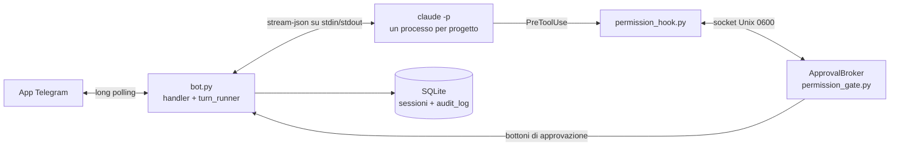

[English](./README.md) | **Italiano**

# Telegram Claude Code Bridge

Un bot Telegram che ti fa usare dal telefono il Claude Code installato sul tuo PC Linux, approvando con un bottone ogni azione a rischio.

[](https://github.com/AndreaBonn/claude-phone/actions/workflows/ci.yml)


Quello che scrivi al bot arriva a Claude Code; quello che Claude Code fa e risponde torna in chat. Quando Claude vuole eseguire un comando o modificare un file, il bot ti chiede prima il permesso.

Il bot non parte mai da solo: lo accendi con `./start.sh` quando vuoi essere raggiungibile e lo spegni con `./stop.sh`. È uno strumento per un solo utente: ogni messaggio va a un processo locale `claude -p` (stream-json in ingresso e in uscita), uno per progetto, e un hook `PreToolUse` fa passare ogni chiamata a uno strumento da un gate di permessi a cui rispondi da Telegram.

## In pratica

Per ogni chiamata a uno strumento il gate decide uno di tre esiti. Questo è l'output reale di `permission_policy.classify_tool_call` per quattro chiamate fatte dal progetto `work/invoices`:

```text
Read                       {'file_path': 'README.md'}         -> allow
Bash                       {'command': 'uv run pytest -q'}    -> ask
Edit                       {'file_path': '/etc/hosts'}        -> block Percorso fuori dalla sandbox: /etc/hosts
mcp__context7__query-docs  {}                                 -> ask
```

Un `ask` diventa questo messaggio Telegram, con sotto i bottoni `✅ Approva`, `🔁 Sempre questo comando`, `❌ Nega`, `🚫 Nega e stop sessione`:

```text
🔐 Approvazione richiesta · work/invoices
Bash
uv run pytest -q
```

I testi dell'interfaccia del bot sono in italiano.

## Stack tecnologico

- Python >= 3.11, gestito con [uv](https://docs.astral.sh/uv/)
- [python-telegram-bot](https://python-telegram-bot.org/) >= 21, long polling
- pydantic-settings per la validazione di `.env`
- SQLite (libreria standard) per sessioni, stato utente, approvazioni aperte e audit log
- Claude Code CLI in modalità headless (`claude -p --input-format stream-json --output-format stream-json`)

## Architettura



Claude lancia l'hook prima di ogni chiamata a uno strumento. L'hook interroga il broker dentro il bot; il broker applica la policy (allow, ask, block) e, per `ask`, aspetta il tuo bottone. Qualsiasi errore lungo questo percorso nega la chiamata.

## Prerequisiti

- Linux, Python 3.11 o successivo, [uv](https://docs.astral.sh/uv/)
- Claude Code installato e autenticato: `claude auth status` deve rispondere senza errori
- Un account Telegram

## Installazione

### 1. Crea il bot su Telegram

1. Apri una chat con [@BotFather](https://t.me/botfather).
2. Invia `/newbot`, scegli un nome e uno username che finisca in `bot`.
3. BotFather risponde con un token del tipo `123456789:AA...`: è `TELEGRAM_BOT_TOKEN`. Non condividerlo e non committarlo.
4. Scrivi a [@userinfobot](https://t.me/userinfobot): risponde con il tuo user ID numerico, che va in `ALLOWED_USERS`.
5. Consigliato: in BotFather invia `/setjoingroups`, scegli il bot e poi `Disable`, così nessuno può aggiungerlo a un gruppo.
6. Apri la chat con il tuo bot e premi **Avvia**: finché non lo fai, il bot non può scriverti per primo.

### 2. Prepara il progetto

1. Clona il repository ed entra nella cartella.
2. Installa le dipendenze:

   ```bash
   uv sync
   ```

3. Crea il file di configurazione:

   ```bash
   cp .env.example .env
   ```

## Configurazione

Copia `.env.example` in `.env` e compilalo.

| Nome | Obbligatoria | Descrizione |
|---|---|---|
| `TELEGRAM_BOT_TOKEN` | ✅ | Il token di BotFather |
| `ALLOWED_USERS` | ✅ | Il tuo user ID Telegram; più ID separati da virgola |
| `APPROVED_DIRECTORY` | ✅ | Una o più cartelle radice separate da virgola. Ogni sotto-cartella diretta di una radice è un progetto chiamato `<radice>/<cartella>`. Le radici devono avere nomi diversi e non stare una dentro l'altra. Se una radice contiene questo repository, il bridge viene escluso in automatico |
| `CLAUDE_ALLOWED_TOOLS` | ⚠️ | Strumenti che Claude può usare (default `Read,Grep,Glob,Bash,Edit,Write`) |
| `CLAUDE_AUTO_APPROVE_TOOLS` | ⚠️ | Strumenti approvati senza chiedere (default, sola lettura: `Read,Grep,Glob,LS`) |
| `CLAUDE_TIMEOUT_SECONDS` | ⚠️ | Secondi di silenzio di Claude dopo cui il turno viene chiuso (default 300). L'attesa di una tua approvazione non conta |
| `APPROVAL_TIMEOUT_SECONDS` | ⚠️ | Secondi per rispondere a una richiesta di approvazione, poi l'azione è negata (default 300) |
| `VERBOSE_LEVEL` | ⚠️ | Dettaglio di default del progresso: 0, 1 o 2 (default 1) |
| `DB_PATH` | ⚠️ | Percorso del database SQLite (default `./data/bridge.db`) |
| `LOG_LEVEL` | ⚠️ | Livello di log (default `INFO`) |
| `CLAUDE_PROFILE` | ⚠️ | Profilo Claude all'avvio, una sotto-cartella di `CLAUDE_PROFILES_DIR`. Vuoto significa `~/.claude` |
| `CLAUDE_PROFILES_DIR` | ⚠️ | Cartella dei profili (default `~/.cloak/profiles`, il layout di cloak) |
| `CLAUDE_BIN` | ⚠️ | Comando di Claude Code, se non è `claude` nel `PATH` |
| `ANTHROPIC_API_KEY` | ⚠️ | Solo se vuoi la fatturazione API a consumo invece del login in abbonamento |

## Esecuzione locale

```bash
./start.sh                # in primo piano, Ctrl+C per fermare
./start.sh --background   # staccato dal terminale
./stop.sh                 # arresto pulito
```

`start.sh` controlla il login di Claude Code per il profilo di avvio, rifiuta un secondo avvio se il bot è già acceso e stampa `Bot attivo, in ascolto` quando è pronto. Su Telegram ricevi `🟢 Bot online` all'accensione e `🔴 Bot disattivato` allo spegnimento. I messaggi mandati mentre il bot era spento vengono scartati all'avvio, quindi niente viene eseguito in ritardo.

### Profili (cloak)

Un profilo è una cartella dentro `CLAUDE_PROFILES_DIR` con il suo login. Il bot avvia Claude Code con `CLAUDE_CONFIG_DIR` puntato al profilo scelto. `/profile` mostra `default` e i profili trovati come bottoni; `/profile sales` cambia direttamente. La scelta resta salvata dopo un riavvio e prevale su `CLAUDE_PROFILE`. Ogni profilo ha le sue sessioni.

`claude auth status` risponde "loggato" anche con il token scaduto, quindi `start.sh` non se ne accorge. In quel caso il bot risponde con un errore 401 e un suggerimento: sul PC apri Claude Code con quel profilo e rifai `/login`.

### systemd (facoltativo, solo avvio manuale)

`systemd/telegram-claude-bridge.service` è una unit utente senza sezione `[Install]`: `systemctl --user enable` la rifiuta, quindi non può partire al login. Il file è un modello: `systemd/install-unit.sh` inserisce il percorso del repository e le directory di `uv` e `claude`, e installa il risultato in `~/.config/systemd/user` (con `--print` lo mostra senza installarlo). Se sposti il repository, rilancialo.

```bash
systemd/install-unit.sh
systemctl --user start telegram-claude-bridge
systemctl --user stop telegram-claude-bridge
```

## Comandi Telegram

| Comando | Effetto |
|---|---|
| `/start` | Messaggio di benvenuto e lista dei progetti, un bottone per ciascuno |
| `/projects` | Progetti a pagine da 20; quello attivo è segnato |
| `/switch <radice>/<nome>` | Cambia progetto, riprendendo la sessione salvata se esiste |
| `/stop` | Interrompe il turno in corso di Claude; la sessione e il suo contesto restano |
| `/new`, `/clear` | Chiude la sessione del progetto attivo; il prossimo messaggio ne apre una pulita |
| `/status` | Progetto, sessione, stato del processo Claude, approvazioni per la sessione, verbosità, approvazioni in attesa, sandbox |
| `/profile [nome]` | Profilo Claude da usare: bottoni, oppure cambio diretto con il nome |
| `/verbose 0\|1\|2` | 0 solo la risposta finale, 1 strumenti usati in tempo reale, 2 strumenti con input completo |

Tutto il resto che scrivi va a Claude Code nel progetto attivo. Mentre Claude lavora vedi un messaggio di progresso con il bottone `⏹️ Stop`; la risposta arriva come messaggio nuovo, così il telefono ti avvisa. I messaggi mandati durante un turno vengono messi in coda.

### Approvazioni

| Strumento | Comportamento |
|---|---|
| `Read`, `Grep`, `Glob`, `LS` | Approvati in automatico |
| `TodoWrite`, `Task`, `Agent`, `ExitPlanMode`, `Skill`, `ToolSearch` | Approvati in automatico: non toccano file, e le chiamate dei sub-agent passano dallo stesso gate |
| `Bash`, `Edit`, `Write` e qualunque altro strumento (strumenti MCP, `NotebookEdit`, `WebFetch`) | Messaggio con i bottoni approva, approva sempre, nega, nega e stop |
| Qualunque percorso fuori dalle radici di `APPROVED_DIRECTORY`, o dentro la cartella del bridge | Bloccato sempre, anche se approveresti |

"Approva sempre" copre un singolo comando Bash esatto, oppure un intero strumento non-Bash, per la sessione corrente. Queste autorizzazioni vivono solo in memoria e vengono revocate da `/new`, da un cambio di profilo o da un riavvio. Le richieste senza risposta vengono negate dopo `APPROVAL_TIMEOUT_SECONDS`; quelle ancora aperte a un riavvio vengono marcate come annullate.

### Bottoni di scelta e allegati

In modalità headless Claude Code non ha lo strumento `AskUserQuestion`. Il prompt di sistema `prompts/telegram-bridge-system-v3.md` insegna a Claude due righe di controllo:

- `[[option: etichetta]]`: ogni riga diventa un bottone, e l'etichetta scelta torna a Claude come tuo messaggio successivo.
- `[[file: percorso]]`: il file arriva come documento Telegram (al massimo 50 MB ciascuno, 10 per messaggio, dentro la sandbox).

I deliverable scritti da un `Write` riuscito durante il turno (Markdown, PDF, immagini, CSV, HTML, file office) vengono allegati anche quando Claude non scrive la riga.

Una sessione mantiene il prompt di sistema con cui è stata creata, quindi una modifica al prompt arriva solo alle sessioni aperte dopo (`/new`).

## Struttura del repository

```text
src/
  bot.py                 avvio, cablaggio degli handler, ciclo di vita
  config.py              caricamento e validazione di .env
  auth.py                whitelist utenti
  claude_session.py      un processo `claude -p` stream-json per progetto
  session_manager.py     sessioni per progetto e profilo, resume
  permission_policy.py   regole allow / ask / block e controllo sandbox
  permission_gate.py     broker delle approvazioni su socket Unix
  permission_hook.py     hook PreToolUse lanciato da Claude Code (solo libreria standard)
  turn_runner.py         un turno: progresso, risposta, bottoni, allegati
  file_delivery.py       risoluzione e invio degli allegati
  session_store.py       SQLite: sessioni, stato utente, audit log, approvazioni aperte
  logging_setup.py       log su file a rotazione con oscuramento dei segreti
  handlers/              comandi, messaggi di testo, bottoni, progetti, profili
tests/                   suite pytest, finto binario `claude`, finto bot Telegram
prompts/                 prompt di sistema versionati
systemd/                 unit facoltativa, non abilitabile
start.sh, stop.sh        avvio e arresto manuali
```

## Testing

```bash
uv run pytest
uv run pytest --cov=src --cov-branch --cov-report=term-missing
uv run ruff check . && uv run mypy src tests
```

La suite (pytest con pytest-asyncio) usa un finto binario `claude`, `tests/fake_claude.py`, che parla lo stesso protocollo stream-json, e fa girare il vero script dell'hook contro un vero socket del broker.

Verifica end-to-end manuale con un bot vero:

1. `./start.sh` e attendi `🟢 Bot online` su Telegram.
2. `/start`, scegli un progetto, chiedi a Claude di leggere un file: nessun bottone, risposta in chat.
3. Chiedi di eseguire `ls` con Bash e premi approva: il comando parte.
4. Chiedi di creare un file con Bash e premi nega: il file non deve esistere.
5. `/switch` su un altro progetto e ritorno: la conversazione precedente riprende.
6. `./stop.sh` e attendi `🔴 Bot disattivato`.

## Sicurezza

Le sessioni caricano tutta la tua configurazione di Claude Code (rule, `CLAUDE.md`, skill, hook, plugin, server MCP) dal profilo scelto e dalla cartella del progetto. Il controllo dei percorsi in Bash è una scansione dei token, non un sandbox vero: per i comandi di shell la protezione reale è leggere il comando prima di approvarlo. I dettagli e l'elenco delle misure verificate sono in [SECURITY.it.md](./SECURITY.it.md), dove trovi anche come segnalare una vulnerabilità.

## Licenza

Rilasciato con licenza Apache 2.0. Vedi [LICENSE](./LICENSE) e [NOTICE](./NOTICE). Puoi usare, modificare e ridistribuire il progetto liberamente; le ridistribuzioni devono mantenere il file NOTICE, che cita l'autore.

## Supporta il progetto

Se questo progetto ti è stato utile, lascia una stella su [GitHub](https://github.com/AndreaBonn/claude-phone) e citalo dove lo usi.

Telegram Claude Code Bridge è gratuito. Se ti è utile e vuoi contribuire, puoi lasciare un'offerta tramite PayPal. L'importo lo scegli tu ed è del tutto facoltativo.

<div align="center">

[](https://paypal.me/AndreaBonacci19)

</div>
