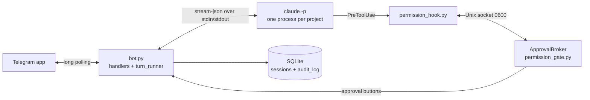

**English** | [Italiano](./README.it.md)

# Telegram Claude Code Bridge

A Telegram bot that lets you drive the Claude Code installed on your Linux PC from your phone, approving every risky action with a button.

[](https://github.com/AndreaBonn/claude-phone/actions/workflows/ci.yml)


What you write to the bot reaches Claude Code; what Claude Code does and answers comes back to the chat. When Claude wants to run a command or change a file, the bot asks for your permission first.

The bot never starts on its own: you switch it on with `./start.sh` when you want to be reachable and off with `./stop.sh`. It is a single-user tool: each message goes to a local `claude -p` process (stream-json in and out), one per project, and a `PreToolUse` hook routes every tool call through a permission gate that you answer from Telegram. The architecture is inspired by [RichardAtCT/claude-code-telegram](https://github.com/RichardAtCT/claude-code-telegram), written from scratch with a narrower scope.

## In practice

The gate decides one of three outcomes for every tool call Claude makes. This is the real output of `permission_policy.classify_tool_call` for four calls issued from the project `work/invoices`:

```text
Read                       {'file_path': 'README.md'}         -> allow
Bash                       {'command': 'uv run pytest -q'}    -> ask
Edit                       {'file_path': '/etc/hosts'}        -> block Percorso fuori dalla sandbox: /etc/hosts
mcp__context7__query-docs  {}                                 -> ask
```

An `ask` becomes this Telegram message, with the buttons `✅ Approva`, `🔁 Sempre questo comando`, `❌ Nega`, `🚫 Nega e stop sessione` under it:

```text
🔐 Approvazione richiesta · work/invoices
Bash
uv run pytest -q
```

The bot's interface texts are in Italian.

## Tech stack

- Python >= 3.11, managed with [uv](https://docs.astral.sh/uv/)
- [python-telegram-bot](https://python-telegram-bot.org/) >= 21, long polling
- pydantic-settings for `.env` validation
- SQLite (standard library) for sessions, user state, pending approvals and the audit log
- Claude Code CLI in headless mode (`claude -p --input-format stream-json --output-format stream-json`)

## Architecture



Claude runs the hook before every tool call. The hook asks the broker inside the bot; the broker applies the policy (allow, ask, block) and, for `ask`, waits for your button. Any error on this path denies the call.

## Prerequisites

- Linux, Python 3.11 or later, [uv](https://docs.astral.sh/uv/)
- Claude Code installed and logged in: `claude auth status` must answer without errors
- A Telegram account

## Installation

### 1. Create the bot on Telegram

1. Open a chat with [@BotFather](https://t.me/botfather).
2. Send `/newbot`, pick a name and a username ending in `bot`.
3. BotFather replies with a token like `123456789:AA...`: that is `TELEGRAM_BOT_TOKEN`. Do not share it or commit it.
4. Write to [@userinfobot](https://t.me/userinfobot): it replies with your numeric user ID, which goes in `ALLOWED_USERS`.
5. Recommended: in BotFather send `/setjoingroups`, pick the bot, then `Disable`, so nobody can add it to a group.
6. Open the chat with your bot and press **Start**: until you do, the bot cannot write to you first.

### 2. Set up the project

1. Clone the repository and enter it.
2. Install the dependencies:

   ```bash
   uv sync
   ```

3. Create the configuration file:

   ```bash
   cp .env.example .env
   ```

## Configuration

Copy `.env.example` to `.env` and fill it in.

| Name | Required | Description |
|---|---|---|
| `TELEGRAM_BOT_TOKEN` | ✅ | Token from BotFather |
| `ALLOWED_USERS` | ✅ | Your Telegram user ID; several IDs comma-separated |
| `APPROVED_DIRECTORY` | ✅ | One or more root folders, comma-separated. Every direct sub-folder of a root is a project named `<root>/<folder>`. Roots need distinct names and must not be nested. If a root contains this repository, the bridge is excluded automatically |
| `CLAUDE_ALLOWED_TOOLS` | ⚠️ | Tools Claude may use (default `Read,Grep,Glob,Bash,Edit,Write`) |
| `CLAUDE_AUTO_APPROVE_TOOLS` | ⚠️ | Tools approved without asking (default, read-only: `Read,Grep,Glob,LS`) |
| `CLAUDE_TIMEOUT_SECONDS` | ⚠️ | Seconds of silence from Claude before the turn is closed (default 300). Time spent waiting for your approval does not count |
| `APPROVAL_TIMEOUT_SECONDS` | ⚠️ | Seconds to answer an approval request, then the action is denied (default 300) |
| `VERBOSE_LEVEL` | ⚠️ | Default progress detail: 0, 1 or 2 (default 1) |
| `DB_PATH` | ⚠️ | SQLite database path (default `./data/bridge.db`) |
| `LOG_LEVEL` | ⚠️ | Log level (default `INFO`) |
| `CLAUDE_PROFILE` | ⚠️ | Claude profile at startup, a sub-folder of `CLAUDE_PROFILES_DIR`. Empty means `~/.claude` |
| `CLAUDE_PROFILES_DIR` | ⚠️ | Profiles folder (default `~/.cloak/profiles`, the cloak layout) |
| `CLAUDE_BIN` | ⚠️ | Claude Code command, if it is not `claude` in `PATH` |
| `ANTHROPIC_API_KEY` | ⚠️ | Only if you want pay-per-use API billing instead of the subscription login |

## Running locally

```bash
./start.sh                # foreground, Ctrl+C to stop
./start.sh --background   # detached from the terminal
./stop.sh                 # clean stop
```

`start.sh` checks the Claude Code login of the startup profile, refuses a second start while the bot is running and prints `Bot attivo, in ascolto` when ready. On Telegram you receive `🟢 Bot online` at startup and `🔴 Bot disattivato` at shutdown. Messages sent while the bot was off are discarded at startup, so nothing runs late.

### Profiles (cloak)

A profile is a folder under `CLAUDE_PROFILES_DIR` with its own login. The bot starts Claude Code with `CLAUDE_CONFIG_DIR` pointing at the chosen profile. `/profile` lists `default` and the profiles found as buttons; `/profile sales` switches directly. The choice survives a restart and wins over `CLAUDE_PROFILE`. Each profile keeps its own sessions.

`claude auth status` reports "logged in" even with an expired token, so `start.sh` cannot detect it. In that case the bot answers with a 401 error and a hint: on the PC open Claude Code with that profile and run `/login` again.

### systemd (optional, manual start only)

`systemd/telegram-claude-bridge.service` is a user unit without an `[Install]` section: `systemctl --user enable` refuses it, so it cannot start at login. The file is a template: `systemd/install-unit.sh` fills in the repository path and the directories of `uv` and `claude`, and installs the result in `~/.config/systemd/user` (`--print` shows it without installing). Run it again if you move the repository.

```bash
systemd/install-unit.sh
systemctl --user start telegram-claude-bridge
systemctl --user stop telegram-claude-bridge
```

## Telegram commands

| Command | Effect |
|---|---|
| `/start` | Welcome message and project list, one button per project |
| `/projects` | Projects in pages of 20; the active one is marked |
| `/switch <root>/<name>` | Switch project, resuming its saved session if there is one |
| `/stop` | Interrupt Claude's running turn; the session and its context are kept |
| `/new`, `/clear` | Close the active project's session; the next message opens a clean one |
| `/status` | Project, session, Claude process state, session-wide approvals, verbosity, pending approvals, sandbox |
| `/profile [name]` | Claude profile to use: buttons, or a direct switch by name |
| `/verbose 0\|1\|2` | 0 final answer only, 1 tools used in real time, 2 tools with full input |

Everything else you write goes to Claude Code in the active project. While Claude works you see a progress message with a `⏹️ Stop` button; the answer arrives as a new message so the phone notifies you. Messages sent during a turn are queued.

### Approvals

| Tool | Behavior |
|---|---|
| `Read`, `Grep`, `Glob`, `LS` | Approved automatically |
| `TodoWrite`, `Task`, `Agent`, `ExitPlanMode`, `Skill`, `ToolSearch` | Approved automatically: they touch no files, and subagent tool calls go through the same gate |
| `Bash`, `Edit`, `Write` and any other tool (MCP tools, `NotebookEdit`, `WebFetch`) | Message with approve, approve-always, deny and deny-and-stop buttons |
| Any path outside the `APPROVED_DIRECTORY` roots, or inside the bridge folder | Always blocked, even if you would approve |

"Approve always" covers one exact Bash command, or a whole non-Bash tool, for the current session. These grants live in memory only and are revoked by `/new`, a profile switch or a restart. Unanswered requests are denied after `APPROVAL_TIMEOUT_SECONDS`; requests still open at a restart are marked as cancelled.

### Choice buttons and attachments

In headless mode Claude Code has no `AskUserQuestion` tool. The system prompt `prompts/telegram-bridge-system-v3.md` teaches Claude two control lines:

- `[[option: label]]`: each line becomes a button, and the chosen label is sent back as your next message.
- `[[file: path]]`: the file is sent as a Telegram document (at most 50 MB each, 10 per message, inside the sandbox).

Deliverables written by a successful `Write` during the turn (Markdown, PDF, images, CSV, HTML, office files) are attached even when Claude does not emit the line.

A session keeps the system prompt it was created with, so a prompt change reaches only sessions opened after it (`/new`).

## Repository structure

```text
src/
  bot.py                 startup, handler wiring, lifecycle
  config.py              .env loading and validation
  auth.py                user whitelist
  claude_session.py      one `claude -p` stream-json process per project
  session_manager.py     sessions per project and profile, resume
  permission_policy.py   allow / ask / block rules and sandbox checks
  permission_gate.py     approval broker on a Unix socket
  permission_hook.py     PreToolUse hook run by Claude Code (standard library only)
  turn_runner.py         one turn: progress, answer, buttons, attachments
  file_delivery.py       resolution and upload of attachments
  session_store.py       SQLite: sessions, user state, audit log, open approvals
  logging_setup.py       rotating file logs with secret redaction
  handlers/              commands, text messages, buttons, projects, profiles
tests/                   pytest suite, fake `claude` binary, fake Telegram bot
prompts/                 versioned system prompts
systemd/                 optional unit, cannot be enabled
start.sh, stop.sh        manual start and stop
```

## Testing

```bash
uv run pytest
uv run pytest --cov=src --cov-branch --cov-report=term-missing
uv run ruff check . && uv run mypy src tests
```

The suite (pytest with pytest-asyncio) uses a fake `claude` binary, `tests/fake_claude.py`, that speaks the same stream-json protocol, and runs the real hook script against a real broker socket.

Manual end-to-end check with a real bot:

1. `./start.sh` and wait for `🟢 Bot online` on Telegram.
2. `/start`, pick a project, ask Claude to read a file: no buttons, answer in chat.
3. Ask it to run `ls` with Bash and press approve: the command runs.
4. Ask it to create a file with Bash and press deny: the file must not exist.
5. `/switch` to another project and back: the previous conversation resumes.
6. `./stop.sh` and wait for `🔴 Bot disattivato`.

## Security

Sessions load your full Claude Code configuration (rules, `CLAUDE.md`, skills, hooks, plugins, MCP servers) from the chosen profile and the project folder. The Bash path check is a token scan, not a real sandbox: for shell commands the actual protection is reading the command before you approve it. Details and the list of verified measures are in [SECURITY.md](./SECURITY.md), which is also where to report a vulnerability.

## License

Released under the Apache License 2.0. See [LICENSE](./LICENSE) and [NOTICE](./NOTICE). You may use, modify and redistribute the project freely; redistributions must keep the NOTICE file, which credits the author.

## Support the project

If this project was useful to you, consider giving it a star on [GitHub](https://github.com/AndreaBonn/claude-phone) and mentioning it where you use it.
